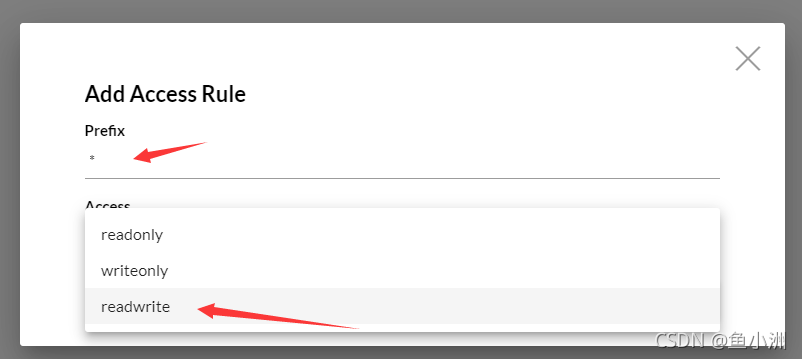

# Minio文件系统搭建及整合

这篇文章主要介绍了使用Java Minio搭建自己的文件系统的方法,文中通过示例代码介绍的非常详细，对大家的学习或者工作具有一定的参考学习价值,需要的朋友可以参考下

##### 目录

[TOC]


## 前言

**本次涉及到的功能有：**

- Minio的安装与启动
- 控制台的使用以及存储桶的创建
- 存储桶的使用权限说明
- 使用控制台实现文件上传与下载
- （重点）使用Springboot与Minio整合实现文件的增删改查

本次使用环境：Centos7.6+finalshell+java


## 1、Minio介绍

如果你听过这个，那么你直接跳到第二小节看使用说明。如果你不知道这个，但是你最近也正在找一款文件存储的工具，那么你可以先看看这个的介绍。

Minio 是一个基于Go语言的对象存储服务。它实现了大部分亚马逊S3云存储服务接口，可以看做是是S3的开源版本，非常适合于存储大容量非结构化的数据，例如图片、视频、日志文件、备份数据和容器/虚拟机镜像等，而一个对象文件可以是任意大小，从几kb到最大5T不等。区别于分布式存储系统，minio的特色在于简单、轻量级，对开发者友好。

阿里云对象存储你应该清楚，这个和OSS的区别就是，OSS收费，这个是你自己搭建的，不收费，只占磁盘大小。其他的功能都是一毛一样的。


## 2、Minio安装与启动


### Windows安装


### Linux安装（Centos7x）

#### 普通安装


首先，我们得先去找到下载地址

- 下载地址：`https://dl.min.io/server/minio/release/linux-amd64/minio`

使用我们的终端工具连接上我们的服务器。

**步骤：**

1.找一个目录，用来存放我们的minio文件

2.使用wget命令，通过下载地址下载下载我们的文件

```
wget https://dl.min.io/server/minio/release/linux-amd64/minio
```

3.给minio这个文件赋予权限，作为文件启动

```
chmod +x minio
```

4.使用`./minio server start`启动


当你能看到这个界面的时候，说明你就成功了。

> 小提示1：
> 下面的两个红色的并不是报错，而是警告，也可以是一个建议。
> 第一句翻译：控制台断点的侦听端口并不是固定的，请使用 --console-address指定端口启动
> 第二句翻译：默认初始凭证账号和密码是minioadmin和minioadmin 你可以在环境变量中去更改他。但是我这儿就不修改了，如果你想修改你可以去profile下面使用export命名来加上他说的那个变量名来指定账号和密码。
> 小提示2：
> 如果你是本地虚拟机，启动后只需要使用ip:9000端口来实现访问，如果访问不了，请关掉防火墙，命令：
> systemctl stop firewalld
> 如果你是云服务器，请放行9000端口和他提示出来的端口。9000作为API端口是不变的，但是你同样可以指定修改他，控制台端口经过我自己测试，他每次启动都会发生改变，所以我们还是建议使用指定端口启动。
> 小提示3：
> 我们上面的启动命令，他启动好了之后日志可以指定到目录去存储，只需要将./minio server start 命令更换成 ./minio server /home/minio/data 其中/home/minio/data是我自己定义的目录，你可以随便定义。
> 第二：启动后会占用控制台，我们也可以将他调整成为后台启动，加上指定的端口，我们就可以完成自定义的设置。具体启动命令如下：
> `nohup ./minio server --console-address ':41169' /home/minio/data/ > /home/minio/data/minio.log 2>&1 &`
> 意思就是，指定控制台端口为41169，并且生成日志文件到/home/minio/data目录下的minio.log中

访问ip:9000进入登录界面 使用默认账号进行登录


#### docker安装

一、查看docker环境是否正常

在命令行使用

~~~shell
docker search minio
~~~

二、下载 minio 的镜像

```Shell
docker pull minio/minio
```

三、创建 minio 容器

查看所有镜像

```powershell
docker images
```

创建并启动minIO容器

~~~shell
docker run -p 9000:9000 -p 9090:9090 \
 --name minio \
 -d --restart=always \
 -e "MINIO_ACCESS_KEY=minioadmin" \
 -e "MINIO_SECRET_KEY=minioadmin" \
 -v /mydata/minio/data:/data \
 minio/minio server \
 /data --console-address ":9090" -address ":9000"
~~~

- 这里的 \ 指的是命令还没有输入完，还需要继续输入命令，先不要执行的意思。
- 这里的9090端口指的是minio的客户端端口。虽然设置9090，但是我们在访问9000的时候，他也会自动跳到9090。
- 9000端口是minio的服务端端口，我们程序在连接minio的时候，就是通过这个端口来连接的。
- -v就是docker run当中的挂载，这里的/mydata/minio/data:/data意思就是将容器的/data目录和宿主机的/mydata/minio/data目录做映射，这样我们想要查看容器的文件的时候，就不需要看容器当中的文件了。
  - 注意在执行命令的时候，他是会自动在宿主机当中创建目录的。我们不需要手动创建。
    minio所上传的文件默认都是存储在容器的data目录下的！
    假如删除容器了宿主机当中挂载的目录是不会删除的。假如没有使用-v挂载目录，那他在宿主机的存储位置的文件会直接删除的。
    宿主机的挂载目录一定是根目录，如果是相对路径会有问题。还有容器当中的目录也是必须是绝对路径（根路径就是带/的）。
    所谓的挂载其实就是将容器目录和宿主机目录进行绑定了，操作宿主机目录，容器目录也会变化，操作容器目录，宿主机目录也会变化。这样做的目的 可以间接理解为就是数据持久化，防止容器误删，导致数据丢失的情况。
- MINIO_ACCESS_KEY:账号 MINIO_SECRET_KEY:密码 (正常账号应该不低于3位，密码不低于8位，不然容器会启动不成功)
- --console-address 指定客户端端口
- -d --restart=always 代表重启linux的时候容器自动启动
- --name minio 容器名称

四、执行之后，查看正在运行的容器

~~~
docker ps
~~~


如果运行容器之后客户端打不开，这时候可以通过`docker logs 容器id`查看日志。


## 3、Minio控制台创建存储桶


这样就创建好了我们的存储桶。


## 4、存储桶权限

在创建好存储桶之后，我们为了使用远程连接来访问使用。所以有必要去修改一下存储桶的权限。


我们点击最下面的那个Rules，然后点击右上角创建一个访问规则。可以使用精准匹配，也可以使用通配符。



前缀我们使用* 这样可以匹配全部访问用户，下面的权限我们使用读写。


## 5、控制台实现文件的上传与下载


我们点到左边的功能栏，然后选择右边我们刚创建的存储桶。然后，，我觉得接下来的操作我都不用细说你们应该都会玩了。


同样，在上传成功后，也提供下载与预览功能。


## 6、使用Springboot与Minio整合实现文件的增删查改


### 6.1、创建项目

略


### 6.2、添加依赖

```xml
<dependency>
    <groupId>io.minio</groupId>
    <artifactId>minio</artifactId>
    <version>6.0.11</version>
</dependency>
```


### 6.3、创建自定义属性与配置类

```yml
minio:
  accesskey: minioadmin
  secretkey: minioadmin
  url: http://ip:9000
  bucketname: xxl-images
```


~~~java
@Component
@Data
public class MinioProperties {
    /**
     * API调用地址
     */
    @Value("${minio.url}")
    private String url;
    /**
     * 连接账号
     */
    @Value("${minio.accesskey}")
    private String accessKey;
    /**
     * 连接秘钥
     */
    @Value("${minio.secretkey}")
    private String secretKey;
}
~~~


~~~java
@Configuration
@Slf4j
public class MinioConfig {
    @Resource
    private MinioProperties minioProperties;
    @Bean
    public MinioClient getMinioClient(){
        try {
            return new MinioClient(minioProperties.getUrl(), minioProperties.getAccessKey(), minioProperties.getSecretKey());
        } catch (InvalidEndpointException | InvalidPortException e) {
            e.printStackTrace();
            log.info("-----创建Minio客户端失败-----");
            return null;
        }
    }
}
~~~


### 6.4、功能实现


#### 6.4.1、文件上传

```java
public void upload(MultipartFile file) throws IOException, XmlPullParserException, NoSuchAlgorithmException, InvalidKeyException, InvalidArgumentException, InvalidResponseException, InternalException, NoResponseException, InvalidBucketNameException, InsufficientDataException, ErrorResponseException {
    if (file == null || file.getSize() == 0 || file.isEmpty()) {
        throw new RuntimeException("上传文件为空，请重新上传");
    }
    // 获取文件名
    String filename = file.getOriginalFilename();
    assert filename != null;
    /* 像下面这样写最主要是为了用来做分割，同时也保证文件名是唯一的 */
    String newFilename = UUID.randomUUID().toString() + "|" + filename + filename.substring(filename.lastIndexOf("."));
    minioClient.putObject(bucketName, newFilename, file.getInputStream(), file.getSize(), null, null, file.getContentType());
}
```


#### 6.4.2、文件下载

```java
public InputStream download(String fileName, HttpServletResponse response) {
    InputStream inputStream = null;
    // 根据文件名拿到minio中的文件对象
    try {
        ObjectStat object = minioClient.statObject(bucketName, fileName);
        // 设置响应头类型
        response.setContentType(object.contentType());
        inputStream = minioClient.getObject(bucketName, fileName);
    } catch (Exception e) {
        e.printStackTrace();
    }
    return inputStream;
}
```


#### 6.4.3、查询全部文件

```java
public Iterable<Result<Item>> listObjects() {
    try {
        return minioClient.listObjects(bucketName);
    } catch (XmlPullParserException e) {
        e.printStackTrace();
    }
    return null;
}
```


#### 6.4.4、删除指定文件

```java
public void deleteFile(String fileName){
    try {
        minioClient.removeObject(bucketName,fileName);
    } catch (Exception e) {
        e.printStackTrace();
    } 
}
```


## 总结

其实操作并不难，你如果发现了我的操作全都是使用的minioClient来实现的时候，你的重心就应该去放在这个类上面，里面所有的方法都有注释，看一遍就能学会。


## 参考资料

[1]. [使用Java Minio搭建自己的文件系统详解](https://www.jb51.net/article/222851.htm)

https://blog.csdn.net/u011174699/article/details/124903036

https://blog.csdn.net/qq_51073233/article/details/127673489

https://blog.csdn.net/Ever_Ardour/article/details/120838919

http://www.cppcns.com/ruanjian/java/523491.html

https://zhuanlan.zhihu.com/p/514794125

[2]. Docker安装MinIO详细步骤介绍：

https://blog.csdn.net/weixin_43888891/article/details/122021704、

https://www.yingsoo.com/news/servers/49799.html

[3]. 双机备份：https://blog.csdn.net/lwq657359703/article/details/120559944

[4]. Minio集群：

https://www.zhangshengrong.com/p/24Njoqr0XB/

https://blog.csdn.net/qq_52497256/article/details/128239273

https://blog.csdn.net/lifulian318/article/details/128490934


