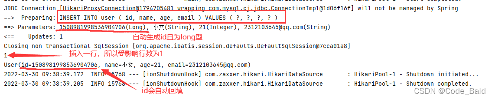
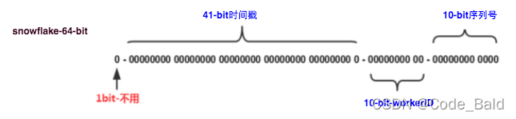
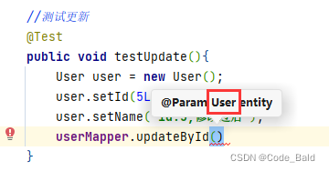
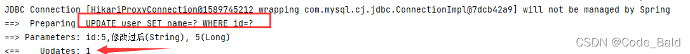
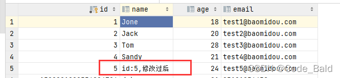
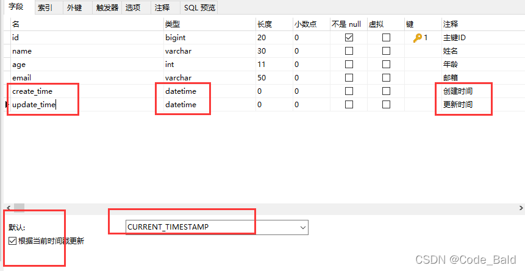
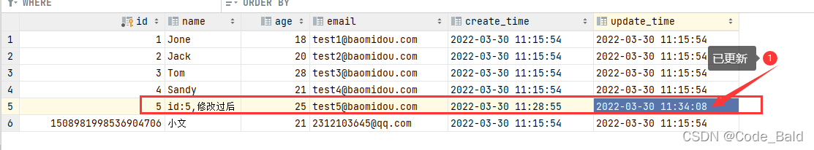
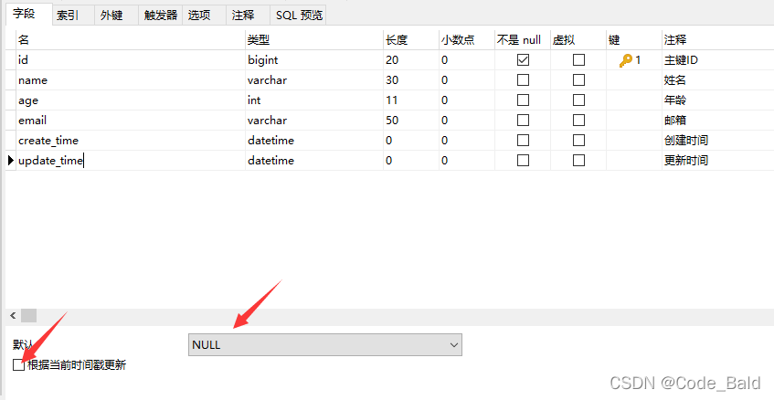

springboot炖mybatis-plus

## 一、什么是MybatisPlus

> 为什么要学MybatisPlus？

MybatisPlus可以节省大量时间，所有的CRUD代码都可以自动化完成

MyBatis-Plus是一个MyBatis的增强工具，在 MyBatis 的基础上只做增强不做改变，为简化开发、提高效率而生。

特性：

- 无侵入：只做增强不做改变，引入它不会对现有工程产生影响，如丝般顺滑

- 损耗小：启动即会自动注入基本 CURD，性能基本无损耗，直接面向对象操作

- 强大的 CRUD 操作：内置通用 Mapper、通用 Service，仅仅通过少量配置即可实现单表大部分 CRUD 操作，更有强大的条件构造器，满足各类使用需求

- 支持 Lambda 形式调用：通过 Lambda 表达式，方便的编写各类查询条件，无需再担心字段写错

- 支持主键自动生成：支持多达 4 种主键策略（内含分布式唯一 ID 生成器 - Sequence），可自由配置，完美解决主键问题

- 支持 ActiveRecord 模式：支持 ActiveRecord 形式调用，实体类只需继承 Model 类即可进行强大的 CRUD 操作

- 支持自定义全局通用操作：支持全局通用方法注入（ Write once, use anywhere ）

- 内置代码生成器：采用代码或者 Maven 插件可快速生成 Mapper 、 Model 、 Service 、 Controller 层代码，支持模板引擎，更有超多自定义配置等您来使用

- 内置分页插件：基于 MyBatis 物理分页，开发者无需关心具体操作，配置好插件之后，写分页等同于普通 List 查询

- 分页插件支持多种数据库：支持 MySQL、MariaDB、Oracle、DB2、H2、HSQL、SQLite、Postgre、SQLServer 等多种数据库

- 内置性能分析插件：可输出 SQL 语句以及其执行时间，建议开发测试时启用该功能，能快速揪出慢查询

- 内置全局拦截插件：提供全表 delete 、 update 操作智能分析阻断，也可自定义拦截规则，预防误操作


## 二、快速入门

### 2.1、创建数据库mybatis_plus

### 2.2、创建user表

~~~sql
DROP TABLE IF EXISTS user;

CREATE TABLE user
(
    id BIGINT(20) NOT NULL COMMENT '主键ID',
    name VARCHAR(30) NULL DEFAULT NULL COMMENT '姓名',
    age INT(11) NULL DEFAULT NULL COMMENT '年龄',
    email VARCHAR(50) NULL DEFAULT NULL COMMENT '邮箱',
    PRIMARY KEY (id)
);
~~~

### 2.3、插入数据

~~~sql
DELETE FROM user;

INSERT INTO user (id, name, age, email) VALUES
(1, 'Jone', 18, 'test1@baomidou.com'),
(2, 'Jack', 20, 'test2@baomidou.com'),
(3, 'Tom', 28, 'test3@baomidou.com'),
(4, 'Sandy', 21, 'test4@baomidou.com'),
(5, 'Billie', 24, 'test5@baomidou.com');
~~~


### 2.4、初始化项目

快速初始化一个空的spring boot 项目

### 2.5、添加依赖

引用spring boot starter 父工程

~~~xml
<parent>
    <groupId>org.springframework.boot</groupId>
    <artifactId>spring-boot-starter-parent</artifactId>
    <version>2.6.5</version>
    <relativePath/>
</parent>
~~~

引入spring-boot-starter、spring-boot-starter-test、mybatis-plus-boot-starter、h2依赖：

~~~xml
<dependencies>
    <dependency>
        <groupId>org.springframework.boot</groupId>
        <artifactId>spring-boot-starter</artifactId>
    </dependency>
    <dependency>
        <groupId>org.springframework.boot</groupId>
        <artifactId>spring-boot-starter-test</artifactId>
        <scope>test</scope>
    </dependency>
    <dependency>
        <groupId>com.baomidou</groupId>
        <artifactId>mybatis-plus-boot-starter</artifactId>
        <version>3.5.1</version>
    </dependency>
    <dependency>
        <groupId>mysql</groupId>
        <artifactId>mysql-connector-java</artifactId>
        <version>8.0.16</version>
    </dependency>
    <dependency>
        <groupId>org.projectlombok</groupId>
        <artifactId>lombok</artifactId>
        <version>1.18.24</version>
    </dependency>
</dependencies>
~~~

注意：尽量不要同时导入mybatis和mybatis_plus,版本差异

### 2.6、配置(连接数据库)

在application.yml配置文件中添加MySQL数据库的相关配置：

~~~yaml
# DataSource Config
spring:
  datasource:
    driver-class-name: com.mysql.cj.jdbc.Driver
    url: jdbc:mysql://127.0.0.1:3306/test?useUnicode=true&characterEncoding=utf8&tinyInt1isBit=false&useSSL=false&serverTimezone=GMT
    username: root
    password: xxxxxx
~~~

在spring boot启动类中添加@MapperScan注解，扫描Mapper文件夹：

```java
@SpringBootApplication
@MapperScan("com.xxl.mybatis_plus.mapper")  //扫描mapper
public class MybatisPlusApplication {
    
    public static void main(String[] args) {
        SpringApplication.run(MybatisPlusApplication.class, args);
    }
}
```

### 2.7、编码

编写实体类User.java（此处使用Lombok简化代码）

~~~
import lombok.Data;

@Data
public class User {
    private Long id;
    private String name;
    private Integer age;
    private String email;
}
~~~

编写Mapper包下的UserMapper接口

~~~java
import com.baomidou.mybatisplus.core.mapper.BaseMapper;
import com.wen.mybatis_plus.pojo.User;
import org.apache.ibatis.annotations.Mapper;

//再对应的mapper上面实现基本的接口 BaseMapper
@Mapper
public interface UserMapper extends BaseMapper<User> {
    //所有的CRUD都已经完成
    //不需要像以前一样配置一大堆文件：pojo-dao（连接mybatis，配置mapper.xml文件）==>service-controller
}
~~~

> **注意：**
>
> **要在主启动类上去扫描mapper包下的所有接口：@MapperScan("com.wen.mybatis_plus.mapper")**

### 2.8、开始使用

添加测试类，进行功能测试：

~~~java
@SpringBootTest
public class MybatisPlusApplicationTests {

    //继承了BaseMapper所有的方法，可以编写自己的扩展方法
    @Autowired
    private UserMapper userMapper;

    @Test
    public void testSelect(){
        System.out.println("--------selectAll method test-------");
        //查询全部用户，参数是一个Wrapper，条件构造器，先不使用为null
        List<User> userList = userMapper.selectList(null);
        userList.forEach(System.out::println);
    }
}
~~~

> **提示：**
>
> **UserMapper中的selectList()方法的参数为MP内置的条件封装器Wrapper，所以不填写就是无任何条件**。

控制台输出：

~~~
User(id=1, name=Jone, age=18, email=test1@baomidou.com)
User(id=2, name=Jack, age=20, email=test2@baomidou.com)
User(id=3, name=Tom, age=28, email=test3@baomidou.com)
User(id=4, name=Sandy, age=21, email=test4@baomidou.com)
User(id=5, name=Billie, age=24, email=test5@baomidou.com)
~~~

### 2.9、小结

以上几个步骤就已经实现User表的CRUD功能，甚至连XML文件都不用编写，以上步骤可以看出集成MyBatis-Plus非常的简单，只需要引入starter工程，并配置mapper扫描路径即可。方法都是MyBatis-Plus写好的，直接引用即可。

## 三、配置日志

> 所有的SQL都是不可见的，所以在后台是希望看到SQL是怎么执行的，就必须要配置日志。

在.yml配置文件中配置日志：

```yaml
#配置日志
mybatis-plus:
  configuration:
    log-impl: org.apache.ibatis.logging.stdout.StdOutImpl
```

打印日志

~~~
--------selectAll method test-------
Creating a new SqlSession
SqlSession [org.apache.ibatis.session.defaults.DefaultSqlSession@1693ff90] was not registered for synchronization because synchronization is not active
JDBC Connection [HikariProxyConnection@221692355 wrapping com.mysql.cj.jdbc.ConnectionImpl@96abc76] will not be managed by Spring
==>  Preparing: SELECT id,`name`,age,email FROM user 
==> Parameters: 
<==    Columns: id, name, age, email
<==        Row: 1, Jone, 18, test1@baomidou.com
<==        Row: 2, Jack, 20, test2@baomidou.com
<==        Row: 3, Tom, 28, test3@baomidou.com
<==        Row: 4, Sandy, 21, test4@baomidou.com
<==        Row: 5, Billie, 24, test5@baomidou.com
<==      Total: 5
Closing non transactional SqlSession [org.apache.ibatis.session.defaults.DefaultSqlSession@1693ff90]
User(id=1, name=Jone, age=18, email=test1@baomidou.com)
User(id=2, name=Jack, age=20, email=test2@baomidou.com)
User(id=3, name=Tom, age=28, email=test3@baomidou.com)
User(id=4, name=Sandy, age=21, email=test4@baomidou.com)
User(id=5, name=Billie, age=24, email=test5@baomidou.com)
~~~

## 四、CRUD

### 4.1、插入测试

~~~
//测试插入
@Test
public void testInsert(){
    User user = new User();
    user.setName("小文");
    user.setAge(21);
    user.setEmail("2312103645@qq.com");

    int insert = userMapper.insert(user);//如果没有设置id，那么会自动生成id
    System.out.println(insert);//受影响行数
    System.out.println(user);//id会自动回填
}
~~~




> 数据库插入ID默认值为全局唯一ID

### 4.2、自定义ID生成器

在复杂分布式系统中，往往需要大量的数据和消息进行唯一标识。比如支付宝每一个账号在数据库分表后都需要有一个唯一ID做标识。此时一个能够生成全局唯一ID的系统是非常必要的。

所以，生成的ID需要具备一下特点：

1. 全局唯一性：不能出现重复的ID号，既然是唯一标识，这是最基本的要求。

2. 趋势递增：在MySQL InnoDB引擎中使用的是聚集索引，由于多数RDBMS使用B-tree的数据结构来存储索引数据，在主键的选择上面我们应该尽量使用有序的主键保证写入性能。

3. 单调递增：保证下一个ID一定大于上一个ID，例如事务版本号、IM增量消息、排序等特殊需求。

4. 信息安全：如果ID是连续的，恶意用户的扒取工作就非常容易做了，直接按照顺序下载指定URL即可；如果是订单号就更危险了，竞对可以直接知道我们一天的单量。所以在一些应用场景下，会需要ID无规则、不规则。


> 上述123对应三类不同的场景，3和4需求还是互斥的，无法使用同一个方案满足。
>

> 在这里只讲两种自动生成ID的方案UUID和SnowFlake
>

可以查看有哪些方法，查看源码：

在用户ID上添加@TableId注解，里面的值便是使用主键自动生成的方法

> 自 3.3.0 开始,默认使用雪花算法+UUID(不含中划线)

~~~
@Data
public class User {
    //对应数据库中的主键（UUID、自增id、雪花算法、redis、zookeeper）
    @TableId(type = IdType.ASSIGN_ID)
    private Long id;
    private String name;
    private Integer age;
    private String email;
}
~~~

> 点击 IdType查看源码看有哪些自动生成方法

~~~java
/**
 * 生成ID类型枚举类
 *
 * @author hubin
 * @since 2015-11-10
 */
@Getter
public enum IdType {
    /**
     * 数据库ID自增
     * <p>该类型请确保数据库设置了 ID自增 否则无效</p>
     */
    AUTO(0),
    /**
     * 该类型为未设置主键类型(注解里等于跟随全局,全局里约等于 INPUT)
     */
    NONE(1),
    /**
     * 用户输入ID
     * <p>该类型可以通过自己注册自动填充插件进行填充</p>
     */
    INPUT(2),
    /* 以下3种类型、只有当插入对象ID 为空，才自动填充。 */
    /**
     * 分配ID (主键类型为number或string）,
     * 默认实现类 {@link com.baomidou.mybatisplus.core.incrementer.DefaultIdentifierGenerator}(雪花算法)
     *
     * @since 3.3.0
     */
    ASSIGN_ID(3),
    /**
     * 分配UUID (主键类型为 string)
     * 默认实现类 {@link com.baomidou.mybatisplus.core.incrementer.DefaultIdentifierGenerator}(UUID.replace("-",""))
     */
    ASSIGN_UUID(4);

    private final int key;

    IdType(int key) {
        this.key = key;
    }
}   
~~~

#### 4.2.1、UUID

UUID(Universally Unique Identifier)的标准型式包含32个16进制数字，以连字号分为五段，形式为8-4-4-4-12的36个字符，示例：550e8400-e29b-41d4-a716-446655440000，到目前为止业界一共有5种方式生成UUID，详情见IETF发布的UUID规范 [A Universally Unique IDentifier (UUID) URN Namespace](http://www.ietf.org/rfc/rfc4122.txt)。

优点：

- 性能非常高：本地生成，没有网络消耗。


缺点：

- 没有排序，无法保证趋势递增。

- UUID往往使用字符串存储，查询的效率比较低。

- 不易于存储：UUID太长，16字节128位，通常以36长度的字符串表示，很多场景不适用。

- 信息不安全：基于MAC地址生成UUID的算法可能会造成MAC地址泄露，这个漏洞曾被用于寻找梅丽莎病毒的制作者位置。

- ID作为主键时在特定的环境会存在一些问题，比如做DB主键的场景下，UUID就非常不适用：
  - MySQL官方有明确的建议主键要尽量越短越好[4]，36个字符长度的UUID不符合要求。
  - 对MySQL索引不利：如果作为数据库主键，在InnoDB引擎下，UUID的无序性可能会引起数据位置频繁变动，严重影响性能。

#### 4.2.2、SnowFlake（雪花算法）

这种方案大致来说是一种以划分命名空间（UUID也算，由于比较常见，所以单独分析）来生成ID的一种算法，这种方案把64-bit分别划分成多段，分开来标示机器、时间等，比如在snowflake中的64-bit分别表示如下图（图片来自网络）所示：



41-bit的时间可以表示（1L<<41）/(1000L360024*365)=69年的时间，10-bit机器可以分别表示1024台机器。如果我们对IDC划分有需求，还可以将10-bit分5-bit给IDC，分5-bit给工作机器。这样就可以表示32个IDC，每个IDC下可以有32台机器，可以根据自身需求定义。12个自增序列号可以表示2^12个ID，理论上snowflake方案的QPS约为409.6w/s，这种分配方式可以保证在任何一个IDC的任何一台机器在任意毫秒内生成的ID都是不同的。

> 核心思想：
>
> 使用41bit作为毫秒数，10bit作为机器的ID(5个bit是数据中心，5个bit的机器ID)，12bit作为毫秒内的流水号（意味着每个节点在每毫秒可以产生4096个ID），最后还有一个符号位，永远是0。

优点：

- 毫秒数在高位，自增序列在低位，整个ID都是趋势递增的。

- 不依赖数据库等第三方系统，以服务的方式部署，稳定性更高，生成ID的性能也是非常高的。

- 可以根据自身业务特性分配bit位，非常灵活。


缺点：

- 强依赖机器时钟，如果机器上时钟回拨，会导致发号重复或者服务会处于不可用状态。

### 4.3、更新操作

> 所有的SQL都是自动配置的

~~~java
//测试更新
@Test
public void testUpdate(){
    User user = new User();
    //可以通过条件自动拼接动态SQL
    user.setId(5L);
    user.setName("id:5,修改过后");
    //updateById 参数是一个对象！
    int i = userMapper.updateById(user);
    System.out.println(i);
}
~~~

> 注意：updateById 参数是一个对象！而不是ID



日志



查看数据库数据



## 五、自动填充

### 5.1、什么是自动填充

在常用业务中有些属性需要配置一些默认值，MyBatis-Plus提供了实现此功能的插件,也就是自动填充功能。比如创建时间、修改时间这些操作一般都是自动化完成的，是不用去手动更新的。

### 5.2、自动填充方式

> 方式一：数据库级别（不建议使用）

1、在表中新增字段create_time,update_time，默认值CURRENT_TIMESTAMP



> 注意：在create_time里除了没有勾选根据当前时间戳更新外其他步骤都一样！

2、在此测试插入方法，需要将实体类同步！！

```java
private Data createTime;
private Data updateTime;
```

3、在此更新查看

```java
//测试更新
@Test
public void testUpdate(){
    User user = new User();
    //可以通过条件自动拼接动态SQL
    user.setId(5l);
    user.setName("id:5,修改过后");
    user.setAge(25);
    //updateById 参数是一个对象！
    int i = userMapper.updateById(user);
    System.out.println(i);
}
```

4、查看时间戳是否更新



> **方式二：代码级别** 

1、删除数据库的默认值，更新操作



2、注解填充字段 `@TableField(.. fill = FieldFill.INSERT)` 生成器策略部分也可以配置！

```java
//注解填充字段 @TableField(.. fill = FieldFill.INSERT) 生成器策略部分也可以配置！
@TableField(fill = FieldFill.INSERT)
private Date createTime;
@TableField(fill = FieldFill.INSERT_UPDATE)
private Date updateTime;
```

3、自定义实现类 MyMetaObjectHandler 处理这个注解


~~~java
@Slf4j
@Component
public class MyMetaObjectHandler implements MetaObjectHandler {
    //插入时的填充策略
    @Override
    public void insertFill(MetaObject metaObject) {
        log.info("start insert fill ....");
        //strictInsertFill(MetaObject metaObject, String fieldName, Class<T> fieldType, E fieldVal)
        this.strictInsertFill(metaObject,"createTime", LocalDateTime.class,LocalDateTime.now());// 起始版本 3.3.0(推荐使用)
    }

    //更新时的填充策略
    @Override
    public void updateFill(MetaObject metaObject) {
        log.info("start update fill ....");
        this.strictUpdateFill(metaObject, "updateTime", LocalDateTime.class, LocalDateTime.now()); // 起始版本 3.3.0(推荐)
    }
}
~~~


## 八、执行SQL分析打印

可输出 SQL 语句以及其执⾏时间，建议开发测试时启⽤该功能，能快速揪出慢查询

注意：PerformanceInterceptor在3.2.0被移除了，如果想进⾏性能分析，⽤第三⽅的，官⽅这样写的“该插件 3.2.0 以上版本移除 推荐使⽤第三⽅扩展 执⾏SQL分析打印 功能”。也就是p6spy。

使用步骤：

#### 8.1、p6spy依赖引入

Maven:

~~~xml
<dependency>
  <groupId>p6spy</groupId>
  <artifactId>p6spy</artifactId>
  <version>最新版本</version> <!--这里用的是>3.9.1版本-->
</dependency>
~~~

### 8.2、application.yml配置

~~~
spring:
  datasource:
    driver-class-name: com.p6spy.engine.spy.P6SpyDriver
    url: jdbc:p6spy:h2:mem:test
    ...
~~~

> 注意： driver-class-name 为 p6spy 提供的驱动类，url 前缀为 jdbc:p6spy 跟着冒号为对应数据库连接地址

实际配置为：

~~~xml
spring:
  datasource:
    driver-class-name: com.p6spy.engine.spy.P6SpyDriver
    url: jdbc:p6spy:mysql:///mybatis_plus?userUnicode=true&characterEncoding=utf-8
    username: root
    password: 123456
    
~~~


## 参考资料

https://blog.csdn.net/m0_46313726/article/details/124187527