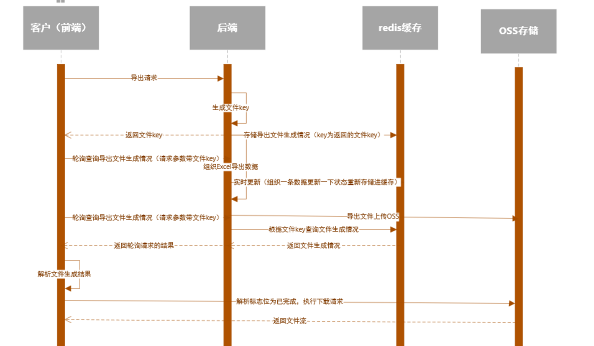

# 导出文件下载进度条简单实现

## 适用场景

用在数据量大、组织数据耗时的情况下的简单实现。

## 设计思路

1、导出数据生成文件上传到OSS。
2、导出数据状态存redis缓存。
3、前端发导出请求后，返回的文件key。
4、请求后端，后端查询缓存情况返回。
5、前端解析是否完成标值，如果完成结束轮询，执行下载get下载，如果未完成，等待下一次轮询。

## 设计时序图

## 参考资料

https://www.bilibili.com/video/BV182421w7qH

https://blog.csdn.net/zwrlj527/article/details/132016058